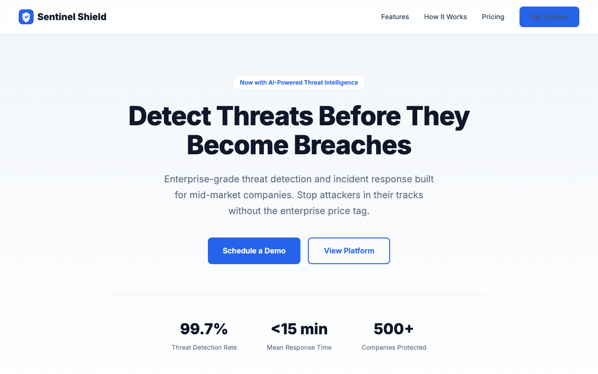
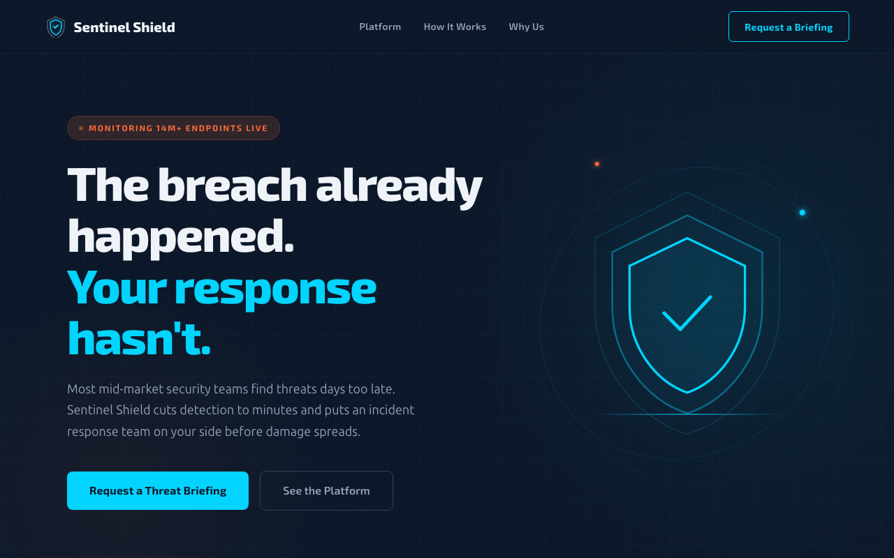

# High Impact Frontend Design

**A Claude Code plugin that makes AI-generated frontends actually look designed.**

Every AI coding tool produces the same output: Inter font, grey cards, flat rectangles, zero atmosphere. This plugin fixes that — systematically.

---

## The Problem

Ask any AI to "build me a landing page" and you'll get:
- **Inter or Roboto** (every time)
- Grey-on-white cards with rounded corners
- "Welcome to [Product]. We help you achieve your goals." as the headline
- No visual personality, no atmosphere, no design point of view
- Output that screams "AI made this"

The model isn't incapable of good design. It just defaults to safe, generic choices because nothing pushes it to commit.

## The Fix

This plugin adds a structured design workflow that forces real design decisions before a single line of code is written:

1. **ASCII wireframes in Plan Mode** — iterate on layout spatially before code exists. Desktop and mobile. The model can't skip ahead to building — Plan Mode mechanically blocks code generation until you approve the wireframe.
2. **A conceptual anchor** — not "modern and clean" but "editorial magazine layout with serif authority and muted earth tones"
3. **Data-driven font selection** — 1,500+ Google Fonts scored across 20 mood dimensions, with popularity weighting so the agent trusts and uses what's recommended
4. **A visual style guide** — rendered in the browser before any page code is written. See your fonts, colors, and atmosphere live. Catch "I don't like that font" when it costs a find-and-replace, not a full rebuild.
5. **A dedicated copywriter** — writes every headline, CTA, and paragraph before the builder touches code. Banned patterns block the usual AI filler. The builder uses the copy verbatim.
6. **A design plan** — fonts, colors, layout, atmosphere, responsive strategy — all decided and approved before building starts
7. **A refinement loop with Plan Mode gates** — significant changes (layout, theme, new sections) re-enter Plan Mode with updated wireframes. Quick tweaks stay fast. The skill stays in control through round 5, not just round 1.
8. **Project memory** — learns your preferences per project so the next build starts smarter
9. **Anti-rationalization enforcement** — every shortcut the model might take has a pre-written counter-argument

The result: distinctive output that looks like a human designer and copywriter made intentional choices.

---

## Before & After

Same prompt: *"Build a landing page for a cybersecurity startup called Sentinel Shield"*

### Without Plugin

Inter font, blue #2563eb, centered layout, "Detect Threats Before They Become Breaches." Could be any SaaS page ever made.

### With Plugin

Exo 2 + Ubuntu Sans, deep navy with surveillance grid, animated shield graphic, "The breach already happened. Your response hasn't."

| | Without Plugin | With Plugin |
|---|---|---|
| **Fonts** | Inter (the default) | Exo 2 + Ubuntu Sans (mood-matched via font selector) |
| **Copy** | "Detect Threats Before They Become Breaches" | "The breach already happened. Your response hasn't." |
| **Atmosphere** | White background, blue buttons, flat cards | Surveillance grid, animated shield, cyan/amber system |
| **Identity** | Generic SaaS template | Looks like a cybersecurity company |

---

## Install

```bash
# Step 1: Add the marketplace
/plugin marketplace add highimpact-dev/highimpact-frontend-skill

# Step 2: Install the plugin
/plugin install highimpact-frontend-design@highimpact-frontend-skill
```

## Usage

Just ask Claude to build something. The skill triggers automatically.

```
> Build me a landing page for a Nashville law firm
> I need an event registration page for a tech conference
> Create a pricing page for my SaaS product
```

### Flags

- `--setup` — First-time setup wizard. Detects your tools, explains what's missing, gives install commands.
- `--walkthrough` — Interactive guided tour. Good for understanding what the skill does before using it.

---

## How It Works

### 1. Discovery
Detects your project: framework (Next.js, Vite, plain HTML), component library (shadcn, Radix), existing design system (CSS variables, Tailwind config). Asks only what it can't detect.

### 2. Design Plan (Plan Mode + ASCII Wireframes)
The creative phase — and the skill's biggest differentiator. The model enters **Plan Mode**, a read-only environment where it literally cannot write code. This forces real design thinking before implementation.

Inside Plan Mode, you get a structured sequence:
1. **Conceptual anchor** — a metaphor that drives all visual decisions ("Nashville recording studio" → warm wood, analog dials, tube amp glow)
2. **Visual direction** — specific font pairing, hex colors, theme, atmosphere — concrete values, not vibes
3. **Desktop wireframe** — a full ASCII layout showing spatial relationships, section sizing, and element placement
4. **Mobile wireframe** — how the layout adapts, what reorders, what hides — designed, not just collapsed
5. **Interaction callouts** — 1-2 signature animation moments annotated against the wireframe

```
┌──────────────────────────────────────────────────────┐
│  LOGO                          [About] [Work] [▤]   │
├──────────────────────────────────────────────────────┤
│  ┌─────────────────────┐  We build things that       │
│  │                     │  matter.                     │
│  │      HERO IMAGE     │  ───────────────────         │
│  │                     │  Subtext about the product   │
│  └─────────────────────┘  [ Get Started ]             │
│  (asymmetric: image 55%, copy 45%)                   │
├──────────────────────────────────────────────────────┤
│   ┌──────────┐   ┌──────────┐   ┌──────────┐        │
│   │ Feature  │   │ Feature  │   │ Feature  │        │
│   │ Card 1   │   │ Card 2   │   │ Card 3   │        │
│   └──────────┘   └──────────┘   └──────────┘        │
│   (3-col grid, staggered entrance animation)         │
├──────────────────────────────────────────────────────┤
```

You iterate on the wireframe inside Plan Mode — "move the image to the right," "make the hero full-width," "swap features and testimonials" — and see the updated layout before any code exists. The model can't skip ahead to building. It exits Plan Mode only after you approve both desktop and mobile wireframes.

### 3. Style Guide Preview
After you approve the plan, the skill generates a **visual style guide** — a rendered HTML page showing your fonts, colors, buttons, and atmosphere in the browser before any page code is written.

You see the actual typography scale (H1–H4, body, small) in the chosen fonts on the chosen background. Color swatches with hex values and live WCAG contrast ratios. Primary, secondary, accent, and ghost button states. A font pairing card showing how headlines and body text work together. And an atmosphere preview rendering the gradients, textures, and mood from the plan.

This catches "I don't like that font" at the cheapest possible moment — swapping a value in a 50-line template instead of hunting through 500 lines of page code. If something feels off, you say so, the skill adjusts the plan and regenerates. Each iteration takes seconds.

### 4. Copywriting
A dedicated copywriter agent writes every headline, body paragraph, CTA, and piece of microcopy — before the builder sees any of it. No more "Welcome to [Product]. We help you achieve your goals."

The copy is written to match the design plan's conceptual anchor and tone. A banned patterns list blocks the usual AI filler: "Transform your X," "Seamless," "Cutting-edge," "Solutions." The builder receives the copy as a build input and uses it verbatim.

### 5. Staged Build
A subagent builds in 4 verified stages:

| Stage | What | Verified Against |
|---|---|---|
| Structure | Semantic HTML, copywriter's content placed | Plan's page structure + Content Map |
| Typography | Font imports, CSS variables, color palette | Plan's visual choices |
| Layout | Grid/flex, responsive breakpoints, mobile-first | Plan's responsive strategy |
| Atmosphere | Gradients, textures, animations, polish | Plan's conceptual anchor |

### 6. Live Testing
Renders in a real browser (if Chrome DevTools or Playwright available). Screenshots at mobile (375px), tablet (768px), and desktop (1280px). Checks for overflow, font loading, console errors, and interaction behavior.

### 7. Design Review & Ship
A review agent compares the output against the plan — including copy fidelity checks to catch any generic replacements the builder might have slipped in. A quality gate runs final checks. You decide when it ships.

### 8. Refinement Loop (Plan Mode for Significant Changes)
First delivery is rarely final. After seeing the output, you iterate — and the skill classifies every piece of feedback to determine the right response:

| Feedback | Response |
|----------|----------|
| Layout change ("move testimonials above pricing") | **Re-enters Plan Mode** — redraws the wireframe, gets your approval, then implements |
| Theme shift ("make it darker, more dramatic") | **Re-enters Plan Mode** — updates visual direction, shows revised foundation |
| New scope ("add a testimonials section") | **Re-enters Plan Mode** — shows where it fits in the wireframe |
| Quick tweak ("make the CTA blue," "bigger font") | Stays inline — edit, screenshot, done |

Significant changes get the same wireframe-first treatment as the initial design. This prevents the #1 failure mode in AI frontend iteration: the model drifting away from the design system after a few rounds of feedback and just becoming "Claude editing a file." Plan Mode re-grounds it.

Quick tweaks stay fast — the skill doesn't force a wireframe for a color change. But every change, no matter how small, gets browser-verified with a screenshot. The skill re-reads its refinement rules every round to prevent context drift.

### 9. Project Memory
The skill creates a `.frontend-magic-memory.md` in your project directory after the first build. It captures your preferences, revision patterns, approved directions, and brand notes — so the next build in that project starts from what it already learned about your taste, not from zero.

### 10. Skill Evolution

The skill gets better across projects — not just within them.

**Phase-scoped loading**: Instead of dumping 800 lines of instructions into context on every run, the skill loads only the current phase's rules. Discovery doesn't carry refinement instructions. The builder doesn't carry discovery rules. This keeps the orchestrator lean across multiple revision rounds.

**Cross-project learnings**: After every shipped build, a Learning Extraction step checks whether revision patterns generalize. "Users keep asking for more whitespace" in 3 different projects becomes a global rule, not 3 separate project memories. Stored in `learnings.md` and read during every Design Plan phase.

**Auto-generated anti-patterns**: When the same type of revision appears across 2+ projects, the skill auto-generates a new anti-rationalization entry — the same `"Excuse" → "Reality"` format used throughout the skill. The model learns from its own failures without manual rule-writing.

Inspired by [MetaClaw](https://github.com/aiming-lab/MetaClaw)'s skill evolution pattern — where agents analyze failure trajectories and generate new skills automatically.

---

## Font Selector

The secret weapon. Instead of guessing fonts from training data, the skill queries **Google Fonts' own mood/personality tag dataset** — 1,502 fonts scored across 20 expressive dimensions.

```bash
node scripts/select-fonts.mjs '{"Futuristic": 80, "Competent": 70, "Active": 60}'
```

### Mood Dimensions
`Active` · `Artistic` · `Awkward` · `Business` · `Calm` · `Childlike` · `Competent` · `Cute` · `Excited` · `Fancy` · `Futuristic` · `Happy` · `Innovative` · `Loud` · `Playful` · `Rugged` · `Sincere` · `Sophisticated` · `Stiff` · `Vintage`

### How Scoring Works

Each font is scored on:
- **Mood alignment** — how well its personality tags match your project's mood profile
- **Popularity** — a percentile from Google Fonts metadata (ensures the agent recognizes and trusts the recommendation)
- **Category contrast** — pairings maximize visual contrast (serif + sans, or different structural subcategories)

### Banned Defaults
These are auto-excluded — they're not bad fonts, they're just what every AI defaults to:

Inter · Roboto · Open Sans · Poppins · Montserrat · DM Sans · Lato · Nunito · Nunito Sans · Raleway · Source Sans 3 · Work Sans · Rubik · Manrope · Plus Jakarta Sans

---

## Architecture

```
Plugin
├── Orchestrator (SKILL.md)          ← Slim router — loads phase files on demand
│   └── phases/                      ← 9 phase files, read just-in-time
├── Plan Mode Gates                  ← Enforced approval checkpoints
│   ├── Design Plan                  ← ASCII wireframes (desktop + mobile), visual direction
│   └── Refinement                   ← Re-entry for layout/theme/scope/voice changes
├── Font Selector (select-fonts.mjs) ← Data-driven font recommendations
├── Copywriter Agent (Sonnet)        ← Headlines, body, CTAs, microcopy
├── Builder Agent (Sonnet)           ← 4-stage code generation
├── Tester Agent (Sonnet)            ← Browser rendering + screenshots
├── Reviewer Agent (Haiku)           ← Plan + copy fidelity check
├── Gate Agent (Haiku)               ← Pre-ship quality verification
├── Project Memory (.md)             ← Per-project learned preferences
└── Cross-Project Learnings (.md)    ← Auto-evolving global patterns
```

The orchestrator stays in your conversation context for creative decisions and the refinement loop. **Plan Mode** gates the two most critical moments — initial design direction and significant revisions — by mechanically blocking code generation until the user approves the wireframed layout. Heavy work (copywriting, building, testing, reviewing) runs in subagents on cost-efficient models with fresh context. Phase instructions load only when needed.

---

## Anti-Rationalization

The highest-leverage pattern in this skill. AI models are excellent at justifying shortcuts. Every escape route has a pre-written counter:

| The Model Says | The Skill Says |
|---|---|
| "Inter is clean and readable" | It's the default. Defaults aren't design. |
| "I'll describe the layout in words" | Words are ambiguous. "Image on the right" could be 40/60 or 50/50 or overlapping. Draw the wireframe. |
| "The user just wants code fast" | A wireframe takes 30 seconds to scan. A wrong-direction rebuild takes 10 minutes. The wireframe IS the fast path. |
| "I'll simplify the responsive strategy" | Build what was planned. Mobile-first, every breakpoint. |
| "Mobile is basically the same but stacked" | Mobile is a different design. Show the wireframe. |
| "This animation is too complex" | The signature moment is what makes it screenshot-worthy. |
| "I'll skip the texture/grain/atmosphere" | That's what separates designed from generic. |
| "Welcome to [Product]. We help you achieve your goals." | A copywriter wrote specific copy. Use it verbatim. |
| "I'll tighten up the copy a bit" | You're a builder, not an editor. The Content Map is a build input. |
| "I'll skip re-entering plan mode, the change is obvious" | If it's a layout change, it's spatial. Draw it. If it's a theme change, it cascades. 30 seconds in plan mode prevents a wrong-direction rebuild. |

---

## Requirements

- **Claude Code** — the CLI tool from Anthropic
- **Node.js** — for the font selector (already required by Claude Code)
- **Optional**: Chrome DevTools MCP or Playwright for live browser testing

## License

See LICENSE.txt for complete terms.
